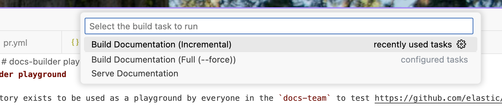

# docs-builder playground

This repository exists to be used as a playground by everyone in the `docs-team` to test https://github.com/elastic/docs-builder

## Usage

Simply clone the repository and open in VS Code.

Then you can use the builtin build command `CMD+SHIFT+B` to build this repositories documentation.




* Incremental: does a full build initially after which it will only compile changed files on each subsequent invocation
* Full: always does a full build.
* Serve: serves the documentation in 'live' mode at http://localhost:8080.
    - All changes should be reflected on the live site without restarting.


## Non VS Code usage

### Incremental

```bash
docker run -v "./.git:/app/.git" -v "./docs:/app/docs" -v "./.artifacts:/app/.artifacts" \
  ghcr.io/elastic/docs-builder:edge
```

This ensures `.git`/`docs` and `.artifacts` (the default output directory) are mounted.

### Full (--force)

```bash
docker run -v "./.git:/app/.git" -v "./docs:/app/docs" -v "./.artifacts:/app/.artifacts" \
  ghcr.io/elastic/docs-builder:edge --force
```

### Live mode

```bash
docker run -v "./.git:/app/.git" -v "./docs:/app/docs" -v "./.artifacts:/app/.artifacts" \
  --expose 8080 ghcr.io/elastic/docs-builder:edge serve
```